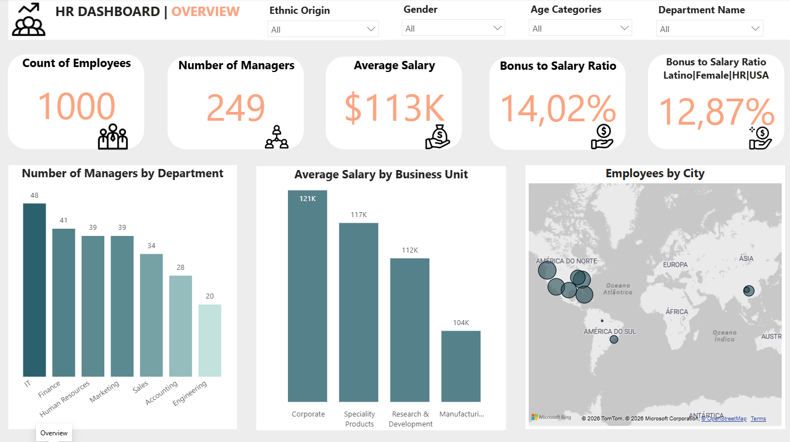
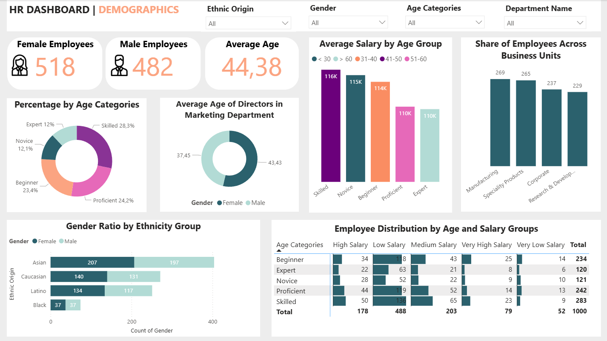
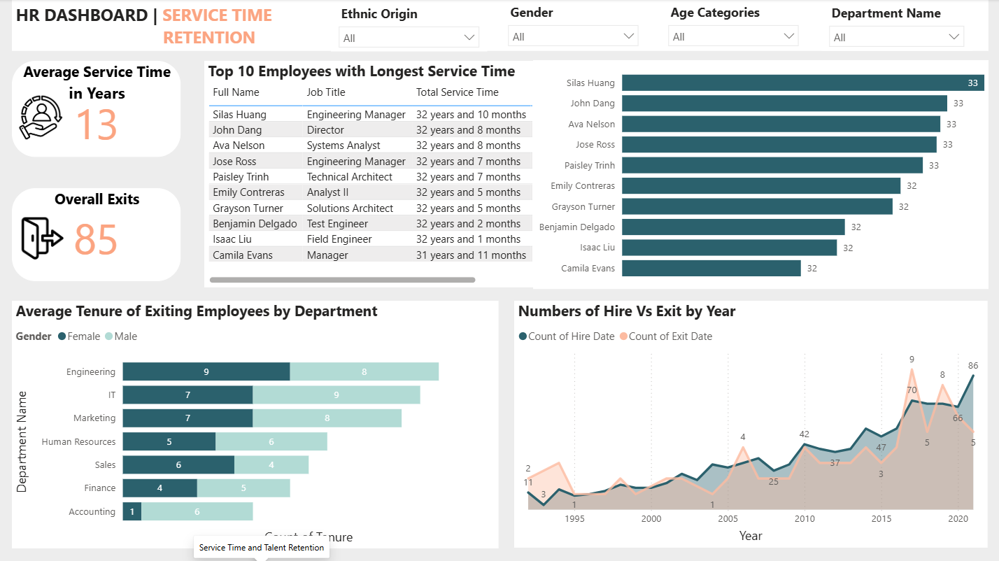

# HR Analytics Dashboard | Power BI

## Project Overview

This project presents a Human Resources Analytics Dashboard developed in Power BI to explore workforce demographics, compensation, employee retention and organizational performance metrics.

The dashboard was designed to transform HR data into actionable business insights through interactive visualizations and KPI monitoring.

The project combines data cleaning, data modeling and dashboard storytelling techniques to support data-driven decision-making in HR management.

---

## Dashboard Pages

The dashboard is divided into three analytical sections:

### 1. Overview
High-level HR metrics and organizational KPIs including:

- Total employees
- Number of managers
- Average salary
- Bonus-to-salary ratio
- Employees by city
- Average salary by business unit

---

### 2. Demographics
Workforce demographic analysis including:

- Gender distribution
- Ethnicity analysis
- Employee age categories
- Salary distribution by age group
- Employee distribution across business units
- Gender ratio by ethnicity group

---

### 3. Retention & Service Time
Employee retention and tenure analysis including:

- Average service time
- Employee exits
- Top employees by service length
- Hire vs exit trends over time
- Average tenure by department

---

## Technologies Used

- Power BI
- Power Query
- Data Modeling
- DAX
- Data Visualization
- Dashboard Design

---

## Data Preparation

The dataset was cleaned and transformed before visualization, including:

- Missing value handling
- Data cleaning
- Relationship adjustments between tables
- Derived columns creation
- KPI calculations

---

## Key Features

- Interactive filters and slicers
- Multi-page dashboard navigation
- KPI monitoring
- Workforce analytics
- Retention analysis
- Geographic visualization
- Demographic analysis

---

## Dashboard Preview

### Overview Page



---

### Demographics Page



---

### Retention Page



---

## Key Insights

- The organization maintains a relatively balanced gender distribution.
- Corporate and Specialty Products business units show the highest average salaries.
- Employee retention trends vary significantly across departments.
- Workforce demographics reveal differences in salary distribution and age categories.
- Long-term employee retention patterns provide insights into organizational stability.

---

## Repository Structure

```text
hr-analytics-dashboard-powerbi/
│
├── dashboard/
│   └── HR Dashboard.pbix
│
├── images/
│   ├── hr_dashboard_overview.png
│   ├── hr_dashboard_demographics.png
│   └── hr_dashboard_retention.png
│
├── documentation/
│   └── CA01_Silva_Karina.pdf
│
└── README.md
